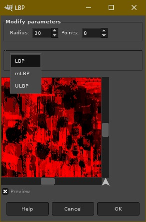
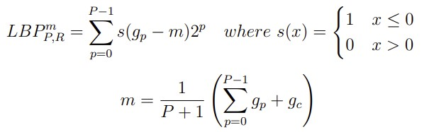
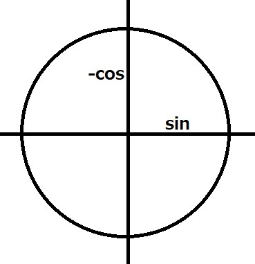
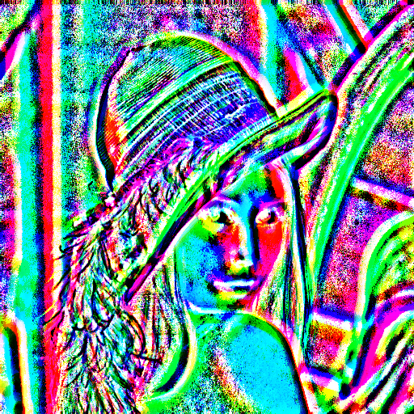
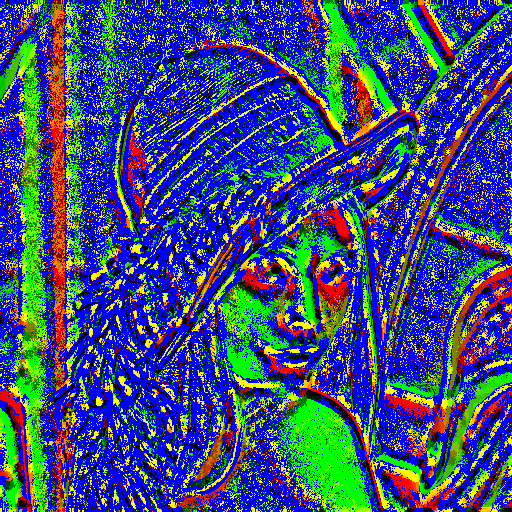

# GIMP plugin for LBP features

## Installation:

In the project directory:

- `make` - creates a plugin *build in the directory
- `make install` - creates a plugin *build and uses gimptool-2.0 to install the build into the user's GIMP plugin directory
- `make uninstall` - uninstalls the plugin from the user's GIMP plugin directory, again using gimptool-2.0
- `make delete` - deletes all compiled objects and the final binary from the current folder

*Note: compilation and linking with `g++` using flags and libraries used by gimptool-2.0. These are obtained using the `--cflags` and `--libs` switch.

## plug-in-lbp-kvasnica

### Description:

When creating a flag, each pixel of the image is scanned and its value is obtained using an evaluation function. Evaluation function works with the surrounding pixels, which are specified by the parameter R - radius, which specifies the distance of the pixels from the current pixel, and the parameter P, which specifies the number of pixels in the current region. The image being manipulated must be converted to grayscale. It is then iterated pixel by pixel, where its defined region for each is evaluated.

## Plugin

It applies a filter to the selected area in the GIMP based on three parameters selected in the UI plugin: radius, number of points and LBP method. After choosing these parameters, the plugin creates a local binary pattern.

As opposed to using grayscale, I used multiple color channels to spread out the number of processed pixels per pixel. Each adjacent pixel has a different weight, so it is not possible to record the entire 24 points in a binary number in the range of 2^8. An eight-point LBP fits in the entire red channel, but a 16-point LBP fits in the red and green channels. Similarly, a 24-point fits into red, green and blue. In that order.

### Settings
- Enable/disable preview
- ComboBox with three different algorithms
- Setting the radius of the points from the pixel
- Number of points evaluating on the imaginary circle according to the specified radius

### Three different LBP methods
Variables: 
- g_c - the central pixel, which indicates the center of the circle. Around it, the positions of the neighbours are calculated according to the radius and the number of points.
- P - the number of all neighbors of the given pixel g_c. Equals the specified number of pixels.
- p - index of the neighbor being processed.

Metody:

- *LBP* - standard one, creates a number based on neighbouring pixels by comparing whether the neighbouring pixels are darker or lighter relative to the central one

- *mLBP* - works exactly the same as *LBP* except that it doesn't compare neighbors to the central pixel, but the average pixel value of all pixels, so neighbors and central one.

- *ULBP* - also works the same as standard *LBP* except that only uniform results are used for output. That is, at most 2 transitions between 1 and 0. 1110011 is uniform, but 11010100 is not. When it is a non-uniform result I use blue color instead.

### LBPKvasnica.cpp
Defines a GTK+ window and all widgets within it.

### Classes

#### ImageProcessor
It encapsulates the entire algorithm. Defines out and in region according to the GimpDrawable or GimpPreview.
The Process method, called from the main LBPKvasnica.cpp plugin file, reads the image from the input region line by line, grays it out, mirror pads the radius parameter lengths around the edges, applies the LBP method, and writes it to the output region. 

#### ImageRegion

The class holds basic information about the image area to be processed. Height, width, and origin of X, Y.
The class is inherited by:

##### InImageRegion

Defines GimpPixelRgn by GIMP drawable. This class reads directly from the gimp region and grays out the read data.

##### OutImageRegion

It also defines GimpPixelRgn, but this time as an output region.

#### Circle

A circle with a finite number of points. A vector structure where the constructed vector points to a pixel, or point, from coordinates 0, 0. The points go in clockwise order starting at 12 o'clock.

Guaranteed by a 90° rotated unit circle.

#### ProcessTile

A structure holding only as many pixels as necessary to process each pixel of the currently processed row.
The width is 2 x the radius + the width of the image.
Height 2 x radius + 1.
Adjacent pixels are reached according to the previously created circle

### Examples

#### Lenna

#### LBP radius 12, points 24

#### ULBP radius 8, points 8

#### ULBP radius 9, points 16

#### mLBP radius 20, points 16

#### Iceland sunset

#### LBP radius 80, points 24
[sunset LBP R80 P24](examples/sunsetLBP-R80-P24.jpg)

#### mLBP radius 25, points 16
[sunset mLBP R25 P16](examples/sunsetmLBP-R25-P16.jpg)

#### LBP radius 10, points 8
[sunset LBP R10 P8](examples/sunsetLBP-R10-P8.jpg)

#### ULBP radius 80, points 16
[sunset ULBP R80 P16](examples/sunsetULBP-R80-P16.jpg)

#### ULBP radius 40, points 8
[sunset ULBP R40 P8](examples/sunsetULBP-R40-P8.jpg)

## Sources:

[Wikipedia LBP](https://cs.wikipedia.org/wiki/Local_Binary_Pattern)

[IEEE LBP Document](https://ieeexplore.ieee.org/document/6014464)

