# LBP Příznaky - Kvasnica

## Instalace:

V adresáři s projektem:

- `make` - vytvoří *build pluginu v adresáři
- `make install` - vytvoří *build pluginu a pomocí nástroje gimptool-2.0 tento build nainstaluje do uživatelského GIMP plugin adredáře
- `make uninstall` - odinstaluje plugin z uživatelského GIMP plugin adresáře, opět pomocí gimptool-2.0
- `make delete` - smaže všechny zkompilované objekty a finální binárku z aktuální složky

*Pozn.: kompilace a linkování pomocí `g++` s využití flagů a knihoven, které používá gimptool-2.0 a vrátí je pomocí přepínače `--cflags` a `--libs`.

## plug-in-lbp-kvasnica

### Popis:

Při vytváření příznaku se prochází každý pixel obrázku a přitom se pomocí ohodnocovací funkce získá jeho hodnota. Ohodnocovací funkce pracuje s okolními pixely, které jsou specifikovány pomocí parametru R - poloměr, udávající vzdálenost bodů od aktuálního pixelu, a parametru P, který stanovuje počet bodů v daném okolí. Obrázek, se kterým pracujeme, se musí převést do stupně šedi. Následně se začne procházet pixel po pixelu a kolem každého se uvažuje jeho definované okolí.

## Plugin

Na vybranou oblast v GIMPu aplikuje filtr na základě třech vybraných parametrů v UI pluginu: poloměru, počtu bodů a LBP metodě, a vytvoří lokální binární vzor.

Oproti použití stupně šedi jsem použil více barevných kanálů, abych rozprostřel počet zpracovaných bodů na pixel. Každý sousední pixel má jinou váhu a proto není možné celých 24 bodů zaznamenat do binárního čísla v rozsahu 2^8. LBP o 8. bodech se vejde do celého červeného kanálu, ale LBP o 16. bodech se vejde do červeného a zeleného. Obdobně 24. do červeného, zeleného a modrého. V tomto pořadí.

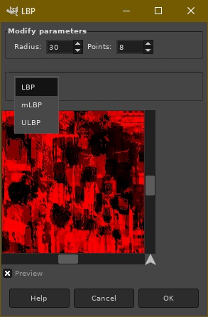

### Nastavení
- Zapnout/vypnout preview
- ComboBox se třemi různými algoritmy
- Nastavování průměru vzdálenosti bodů od zkoumaného pixelu
- Počet bodů vyhodnocujících se na pomyslné kružnici podle zadaného poloměru

### Tři různé LBP metody
Proměnné: 
- g_c - centrální pixel, který udává střed kružnice. Kolem něho jsou podle poloměru a počtu bodů vypočítány pozice sousedů.
- P - počet všech sousedů daného pixelu g_c. Rovná se zadanému počtu bodů.
- p - index zpracovávaného souseda.

Metody:

- *LBP* - klasický, vytvoří číslo na základě sousedících pixelů podle porovnání jestli jsou sousedící pixely tmavší nebo světlejší

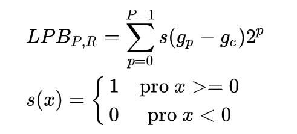

- *mLBP* - funguje naprosto stejně jako *LBP* až na to, že neporovnává sousedy se vstupním pixelem, ale průměrnou hodnotou pixelu všech pixelů, takže sousedů i vstupního pixelu.

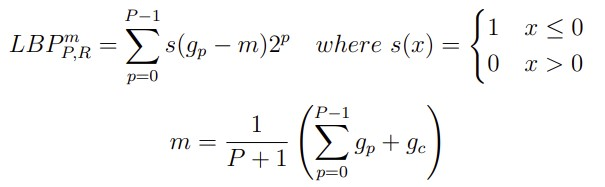

- *ULBP* - taktéž funguje stejně jako základní *LBP* až na to, že se na výstup použijí jenom uniformní výsledky. Tedy maximálně 2 přechody mezi 1 a 0. 1110011 je uniformní, zato 11010100 ne. Když se jedná o neuniformní výsledek použiji místo něho modrou barvu.

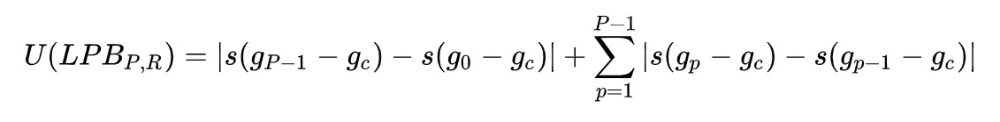

### LBPKvasnica.cpp
Definuje GTK+ okno a všechny Widgety v něm. Inspirace u zdrojového kódu Pavla Kříže v demu6.

### Třídy

#### ImageProcessor
Obaluje celý algoritmus. Definuje out a in region podle získaného GimpDrawable či GimpPreview.
Metoda Process volaná z hlavního souboru pluginu LBPKvasnica.cpp načítá obrázek ze vstupního regionu po řádcích, které zešediví, zrcadlovitě vycpe za okrajemi délky parametru poloměru, aplikuje metodu LBP a vypíše do výstupního regionu. 

#### ImageRegion

Třída drží základní informace o oblasti obrázku ke zpracování. Výška, šířka, a počátek X, Y.
Třídu dědí:

##### InImageRegion

Definuje GimpPixelRgn podle GIMP drawable. Tato třída načítá přímo z gimp regionu a zašediví načtená data.

##### OutImageRegion

Také definuje GimpPixelRgn, ale tentokrát jako výstupní region.

#### Circle

Kružnice s konečným počtem bodů. Sktruktura vektorů, kde zkonstruovaný vektor ukazuje na pixel, neboli na bod, ze souřadnic 0, 0. Body jdou v pořadí od 12 hodin po směru hodinových ručiček.

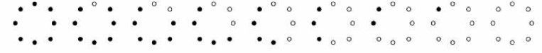

Zaručeno o 90° otočenou jednotkovou kružnicí.

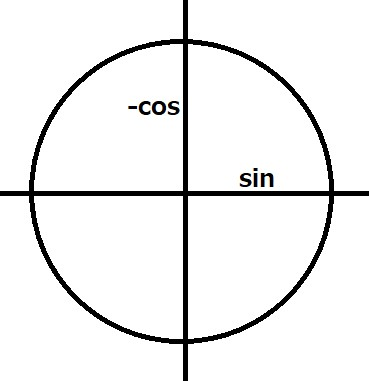

#### ProcessTile

Sktruktura držíci jenom tolik pixelů, kolik je nezbytně nutno ke zpracování každého pixelu aktuálně zpracovávaného řádku. 
Šířka je 2 x poloměr + šířka obrazu.
Výška 2 x poloměr + 1.
Na sousedící pixely se dostává podle předtím vytvořené kružnice

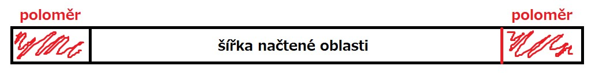

### Příklady

#### Lenna

#### LBP poloměr 12, počet bodů 24
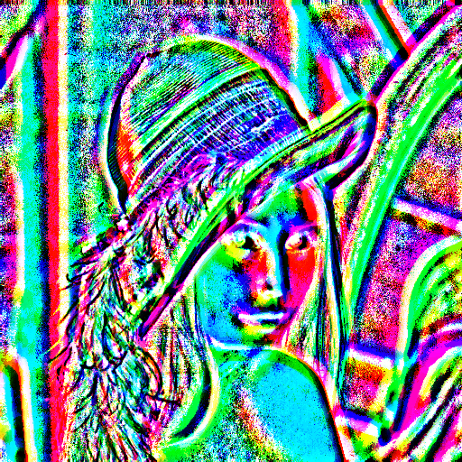

#### ULBP poloměr 8, počet bodů 8
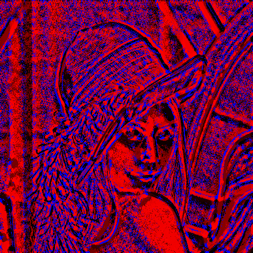

#### ULBP poloměr 9, počet bodů 16
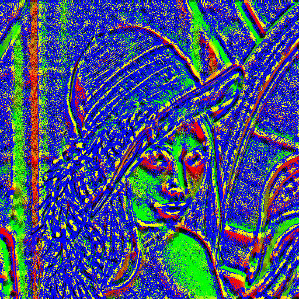

#### mLBP poloměr 20, počet bodů 16
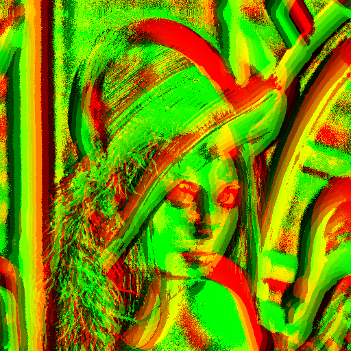

#### Iceland sunset

#### LBP poloměr 80, počet bodů 24
[sunset LBP R80 P24](examples/sunsetLBP-R80-P24.jpg)

#### mLBP poloměr 25, počet bodů 16
[sunset mLBP R25 P16](examples/sunsetmLBP-R25-P16.jpg)

#### LBP poloměr 10, počet bodů 8
[sunset LBP R10 P8](examples/sunsetLBP-R10-P8.jpg)

#### ULBP poloměr 80, počet bodů 16
[sunset ULBP R80 P16](examples/sunsetULBP-R80-P16.jpg)

#### ULBP poloměr 40, počet bodů 8
[sunset ULBP R40 P8](examples/sunsetULBP-R40-P8.jpg)

## Zdroje:

[Wikipedia LBP](https://cs.wikipedia.org/wiki/Local_Binary_Pattern)

[IEEE LBP Document](https://ieeexplore.ieee.org/document/6014464)

